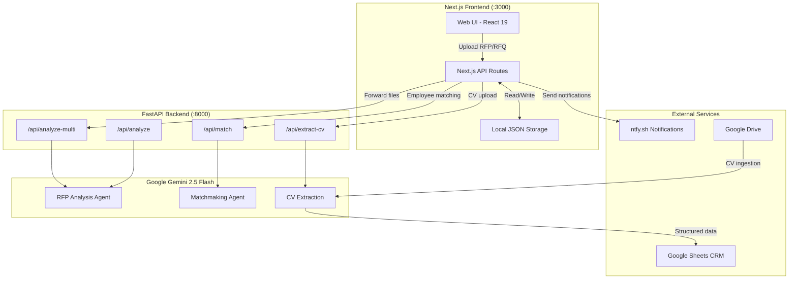
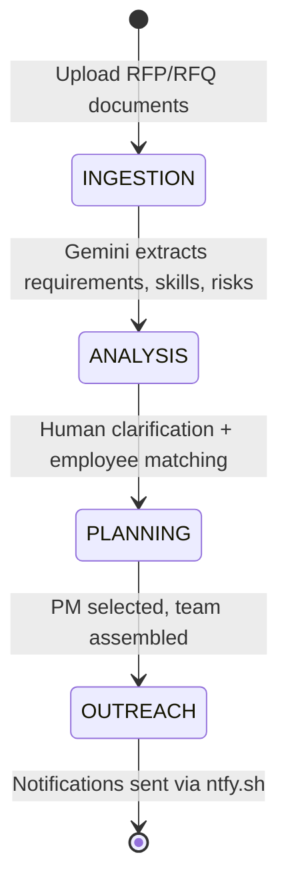

# Sales Engineering Agentic System

An AI-powered multi-agent pipeline that automates the sales engineering workflow: ingest RFP/RFQ documents, extract structured intelligence using Google Gemini, match the best-fit employees from your talent pool, and send outreach notifications — all orchestrated through a modern web interface.

---

## Table of Contents

- [Architecture](#architecture)
- [Tech Stack](#tech-stack)
- [Prerequisites & Setup](#prerequisites--setup)
- [Environment Variables](#environment-variables)
- [Running the Application](#running-the-application)
- [API Documentation](#api-documentation)
- [Core Modules](#core-modules)
- [Data Models](#data-models)
- [CLI Usage](#cli-usage)
- [Project Structure](#project-structure)
- [Dependencies Reference](#dependencies-reference)

---

## Architecture



### Pipeline Flow



1. **Ingestion** — User uploads one or more RFP/RFQ documents (PDF, DOCX, TXT)
2. **Analysis** — Gemini 2.5 Flash extracts structured intelligence: requirements, skills matrix, deadlines, risks, compliance norms
3. **Planning** — System matches employees against extracted requirements, human provides clarification if needed, PM is auto-selected
4. **Outreach** — Notifications are sent to the PM and matched team members via ntfy.sh

---

## Tech Stack

| Layer | Technology | Purpose |
|-------|-----------|---------|
| **Frontend** | Next.js 16, React 19, TypeScript | App Router-based web interface |
| **Styling** | Tailwind CSS v4, Framer Motion | Responsive design and animations |
| **Backend API** | FastAPI, Uvicorn | Python AI/ML service layer |
| **Backend Orchestration** | Next.js API Routes | Request orchestration, state management |
| **AI/ML** | Google Gemini 2.5 Flash | Structured extraction, matchmaking, CV parsing |
| **Document Parsing** | pdfplumber, python-docx, Gemini Files API | PDF/DOCX/TXT text extraction (with multimodal fallback) |
| **Data Storage** | Local JSON files | Employee and project persistence |
| **Notifications** | ntfy.sh | Push notifications to team members |
| **Onboarding** | Google Drive API, Google Sheets API | CV ingestion pipeline to CRM |
| **Validation** | Pydantic v2 | Structured output validation and schemas |

---

## Prerequisites & Setup

### Requirements

- **Python** 3.10+
- **Node.js** 18+
- **Gemini API Key** — [get one here](https://aistudio.google.com/apikey)

### 1. Clone & configure

```bash
git clone <repo-url>
cd web

# Create your .env file
cp .env.example .env
# Set your Gemini API key:
#   GEMINI_API_KEY=your_key_here
```

### 2. Install dependencies

```bash
# Python dependencies (FastAPI + RFP agent + AI libraries)
pip3 install -r requirements.txt

# Node.js dependencies (Next.js frontend)
npm install
```

### 3. Run — open two terminals

**Terminal 1 — Python API server (port 8000):**
```bash
python3 -m uvicorn server:app --port 8000
```

**Terminal 2 — Next.js frontend (port 3000):**
```bash
npm run dev
```

Open [http://localhost:3000](http://localhost:3000) in your browser.

> **Note:** Both servers must be running simultaneously. The frontend proxies AI requests to the Python backend.

### macOS Troubleshooting

- Use `python3` / `pip3` — macOS ships with Python 2 by default
- If `uvicorn` not found: `python3 -m uvicorn server:app --port 8000`
- Port conflict: try `--port 8001` and set `NEXT_PUBLIC_AGENT_API_URL=http://localhost:8001` in `.env`

---

## Environment Variables

| Variable | Required | Default | Description |
|----------|----------|---------|-------------|
| `GEMINI_API_KEY` | **Yes** | — | Google Gemini API key for all AI operations |
| `NEXT_PUBLIC_AGENT_API_URL` | No | `http://localhost:8000` | URL of the Python FastAPI server |
| `CRM_SPREADSHEET_ID` | For onboarding | — | Google Sheets spreadsheet ID for CRM |
| `DROPZONE_FOLDER_NAME` | For onboarding | `01_CV_Dropzone` | Google Drive folder name for incoming CVs |
| `PROCESSED_FOLDER_NAME` | For onboarding | `02_Processed_CVs` | Google Drive folder for processed CVs |
| `SKILLS_DB_SHEET_NAME` | For onboarding | `Skills_DB` | Sheet tab name in the CRM spreadsheet |
| `GEMINI_MODEL` | No | `gemini-1.5-flash` | Model override for onboarding agent |

---

## Running the Application

### Web Interface (recommended)

1. Start both servers (see Setup above)
2. Navigate to `http://localhost:3000`
3. Upload an RFP/RFQ document
4. Review extracted requirements, skills, and risks
5. Provide clarification when prompted
6. View matched employees and selected PM
7. Trigger outreach notifications

### Demo Walkthrough

1. **Upload** — Drag and drop any RFP PDF into the upload zone
2. **Analysis** — The system displays extracted requirements, skills matrix, deadlines, and risks within seconds
3. **Matchmaking** — Answer the clarification question, then view ranked employee matches with fit scores
4. **Outreach** — Click to notify the selected PM and team via push notifications

---

## API Documentation

### Python FastAPI Endpoints (port 8000)

#### `POST /api/analyze`

Analyze a single uploaded RFP document.

| Field | Value |
|-------|-------|
| Content-Type | `multipart/form-data` |
| Body | `file` — PDF, DOCX, or TXT |

**Response:**
```json
{
  "requirements": ["REQ-001 [HIGH*] SCADA integration: ..."],
  "ambiguity": "Scope boundary between Phase 1 and Phase 2 is unclear...",
  "suggestedSkills": ["Siemens TIA Portal — senior × 2"],
  "rfp_title": "...",
  "client_name": "...",
  "rfp_summary": "...",
  "submission_deadline": "2025-06-30",
  "project_duration": "18 months",
  "confidence_score": 0.87,
  "deadlines": [...],
  "risks": [...],
  "dependencies": [...],
  "compliance_norms": [...],
  "key_evaluation_criteria": [...],
  "pitfalls": [...],
  "planning_payload": { ... }
}
```

---

#### `POST /api/analyze-multi`

Analyze multiple uploaded files as one combined RFP.

| Field | Value |
|-------|-------|
| Content-Type | `multipart/form-data` |
| Body | `files` — multiple PDF/DOCX/TXT files |

**Response:** Same schema as `/api/analyze`.

---

#### `POST /api/extract-cv`

Extract structured employee profile from a CV PDF.

| Field | Value |
|-------|-------|
| Content-Type | `multipart/form-data` |
| Body | `file` — PDF CV |

**Response:**
```json
{
  "status": "success",
  "data": {
    "firstName": "Anna",
    "lastName": "Schmidt",
    "email": "anna@example.com",
    "location": "Munich",
    "role": "Automation Engineer",
    "level": "senior",
    "yearsOfExperience": 8,
    "pastIndustryExperience": ["Energy", "Manufacturing"],
    "skills": ["Siemens TIA Portal", "SCADA", "IEC 61850"],
    "certifications": ["ISO 9001 Auditor"],
    "linkedin": "https://linkedin.com/in/anna-schmidt"
  }
}
```

---

#### `POST /api/match`

Match employees against project requirements using Gemini.

| Field | Value |
|-------|-------|
| Content-Type | `application/json` |

**Request:**
```json
{
  "requirements": ["REQ-001 [HIGH*] SCADA integration: ..."],
  "employees": [
    {
      "id": "emp-1",
      "name": "Anna Schmidt",
      "role": "Automation Engineer",
      "skills": ["Siemens TIA Portal", "SCADA", "IEC 61850"]
    }
  ],
  "human_answer": "optional clarification string"
}
```

**Response:**
```json
{
  "matches": [
    {
      "id": "emp-1",
      "name": "Anna Schmidt",
      "role": "Automation Engineer",
      "match": 92,
      "reason": "Direct match on all three core technical skills.",
      "skills": ["Siemens TIA Portal", "SCADA", "IEC 61850"]
    }
  ]
}
```

---

#### `GET /health`

Health check endpoint. Returns `{ "status": "ok" }`.

---

### Next.js API Routes (port 3000)

#### `POST /api/process-rfq`

Orchestrates RFP ingestion: accepts files, calls Python `/api/analyze-multi`, creates project state.

| Field | Value |
|-------|-------|
| Content-Type | `multipart/form-data` |
| Body | `files` — one or more RFP documents |

**Response:**
```json
{
  "status": "success",
  "project": {
    "id": "uuid",
    "stage": "ANALYSIS",
    "requirements": [...],
    "clarificationQuestion": "...",
    "thoughtLog": [...],
    "createdAt": "...",
    "updatedAt": "..."
  }
}
```

---

#### `POST /api/matchmaking`

Adds human clarification, triggers employee matching, auto-selects PM.

**Request:**
```json
{
  "projectId": "uuid",
  "humanAnswer": "We need someone with IEC 61850 experience"
}
```

**Response:**
```json
{
  "status": "success",
  "project": {
    "matchCandidates": [...],
    "selectedPM": { ... },
    "thoughtLog": [...],
    "status": "PLANNING"
  }
}
```

---

#### `POST /api/outreach`

Sends push notifications to selected PM and team members via ntfy.sh.

**Request:**
```json
{
  "projectId": "uuid"
}
```

**Response:**
```json
{
  "status": "success",
  "notifications": [...],
  "pm": { ... }
}
```

---

#### `GET /api/employees`

Returns the full employee list from local storage.

**Response:**
```json
{
  "status": "success",
  "employees": [...]
}
```

---

#### `POST /api/employees/[id]`

Create or update an employee profile by ID.

**Request:** JSON employee object with fields matching the CandidateProfile schema.

---

#### `POST /api/employees/extract`

Upload a CV PDF, extract structured profile via Gemini, store the file, detect duplicates.

| Field | Value |
|-------|-------|
| Content-Type | `multipart/form-data` |
| Body | `file` — PDF CV |

**Response:**
```json
{
  "status": "success",
  "employee": { ... },
  "cvUrl": "/cvs/filename.pdf",
  "matches": []
}
```

---

## Core Modules

### RFP Analysis Agent (`rfp_agent/`)

The core intelligence engine. Analyzes RFP/RFQ documents and extracts structured data.

**How it works:**
1. **Document Loading** — Supports PDF (via pdfplumber or Gemini Files API for scanned docs), DOCX (python-docx), and plain text
2. **Chunking** — For documents exceeding ~700K characters, splits into overlapping paragraph-boundary chunks
3. **Parallel Analysis** — Sends 3 parallel Gemini calls (Part A: metadata + requirements, Part B: skills + deadlines, Part C: risks + compliance) for faster processing
4. **Merge & Deduplicate** — Combines results, deduplicates requirements, renumbers IDs
5. **Structured Output** — Returns a fully validated `RFPAnalysis` Pydantic model

**Key files:**
- `rfp_agent/agent.py` — `RFPAnalysisAgent` class with `analyze_file()` and `to_planning_agent_payload()`
- `rfp_agent/models.py` — Pydantic models (`RFPAnalysis`, `Requirement`, `SkillRequirement`, etc.)
- `rfp_agent/prompts.py` — System, analysis, and merge prompts for Gemini
- `rfp_agent/document_loader.py` — Multi-format document loading with fallbacks

---

### Matchmaking Agent

Ranks employees against extracted requirements using Gemini's reasoning capabilities.

**How it works:**
1. Receives requirements list + employee pool + optional human clarification
2. Sends to Gemini for semantic matching (skills, experience, certifications)
3. Returns ranked list with match scores (0-100) and reasoning

---

### CV Extraction

Extracts structured `CandidateProfile` data from uploaded CV PDFs using Gemini.

**Extracted fields:** name, email, location, role, level, years of experience, industry experience, skills, certifications, LinkedIn URL.

---

### Onboarding Agent (`onboarding_agent/`)

Automated pipeline for bulk CV ingestion from Google Drive into a CRM spreadsheet.

**Flow:**
1. Authenticates with Google APIs (Drive + Sheets)
2. Lists PDFs in a configured Google Drive "dropzone" folder
3. Downloads and parses each CV with Gemini
4. Appends structured data rows to a Google Sheets CRM
5. Moves processed files to an archive folder
6. Continues on per-file failures without stopping

**Key files:**
- `onboarding_agent/main.py` — Pipeline orchestration
- `onboarding_agent/services/extractor.py` — Gemini-powered CV parsing
- `onboarding_agent/services/google_api.py` — Google Drive/Sheets client

---

### Outreach & Notifications

Sends push notifications to team members via [ntfy.sh](https://ntfy.sh) — a simple HTTP-based pub/sub notification service. No signup required.

---

## Data Models

### RFPAnalysis (full output)

```
RFPAnalysis
├── rfp_title               string
├── client_name             string | null
├── rfp_summary             string          — 2-3 sentence executive summary
├── project_scope           string          — detailed scope of work
├── submission_deadline     string | null
├── project_duration        string | null
├── estimated_team_size     string | null
├── budget_constraints      string | null
├── requirements[]          Requirement
│   ├── id                  REQ-001, REQ-002, ...
│   ├── category            functional | technical | operational | compliance | financial | resource
│   ├── title               string
│   ├── description         string
│   ├── priority            high | medium | low
│   ├── is_mandatory        bool
│   ├── skills_needed       string[]
│   └── section_reference   string | null
├── skills_required[]       SkillRequirement
│   ├── skill               string (granular, e.g. "OCPP 2.0.1" not "EV charging")
│   ├── category            technical | domain | certification | soft_skill | language
│   ├── proficiency_level   junior | mid | senior | expert
│   ├── quantity_needed     int
│   ├── context             string
│   └── related_requirement_ids  string[]
├── deadlines[]             Deadline
├── dependencies[]          Dependency
├── risks[]                 Risk
├── compliance_norms[]      ComplianceNorm
├── key_evaluation_criteria string[]
├── pitfalls                string[]
├── analysis_notes          string[]
└── confidence_score        float (0.0–1.0)
```

### Planning Payload (slim handoff)

A lightweight subset of `RFPAnalysis` optimized for downstream agent consumption:

```json
{
  "rfp_title": "...",
  "client_name": "...",
  "submission_deadline": "...",
  "project_duration": "...",
  "estimated_team_size": "...",
  "skills_required": [...],
  "high_priority_requirements": [...],
  "dependencies": [...],
  "compliance_norms": [...]
}
```

### Project States

| State | Description |
|-------|-------------|
| `INGESTION` | Documents uploaded, awaiting analysis |
| `ANALYSIS` | RFP analyzed, clarification question generated |
| `PLANNING` | Employees matched, PM selected |
| `OUTREACH` | Notifications sent to team |

### CandidateProfile / Employee

```json
{
  "firstName": "string",
  "lastName": "string",
  "email": "string",
  "location": "string",
  "role": "string",
  "level": "junior | mid | senior | expert",
  "yearsOfExperience": "number",
  "pastIndustryExperience": ["string"],
  "skills": ["string"],
  "certifications": ["string"],
  "linkedin": "string | null"
}
```

---

## CLI Usage

Run the agent directly from the terminal without the web UI:

```bash
# Single document
python3 main.py rfp.pdf

# Multiple documents
python3 main.py rfp1.pdf rfp2.docx rfp3.pdf

# Save results to files
python3 main.py rfp1.pdf rfp2.pdf --output-dir results/ --planning-dir planning/
# Produces:
#   results/rfp1.json             — full analysis
#   results/rfp2.json
#   planning/rfp1_planning.json   — slim payload for downstream agents
#   planning/rfp2_planning.json
```

---

## Project Structure

```
web/
├── server.py                    — FastAPI backend (port 8000)
├── main.py                      — CLI entry point for batch processing
├── requirements.txt             — Python dependencies
├── package.json                 — Node.js dependencies
├── next.config.ts               — Next.js configuration
├── tsconfig.json                — TypeScript configuration
├── eslint.config.mjs            — ESLint configuration
├── postcss.config.mjs           — PostCSS/Tailwind configuration
│
├── rfp_agent/                   — Core RFP analysis engine
│   ├── __init__.py              — Package exports (RFPAnalysisAgent)
│   ├── agent.py                 — RFPAnalysisAgent class
│   ├── models.py                — Pydantic data models
│   ├── prompts.py               — Gemini prompt templates
│   └── document_loader.py       — PDF/DOCX/TXT loader with fallbacks
│
├── onboarding_agent/            — Google Drive → Sheets CV pipeline
│   ├── main.py                  — Pipeline orchestration
│   ├── config.py                — Environment configuration
│   ├── models.py                — CandidateProfile schema
│   ├── requirements.txt         — Additional Python deps
│   └── services/
│       ├── extractor.py         — Gemini CV extraction
│       └── google_api.py        — Google Drive/Sheets client
│
├── src/
│   ├── app/
│   │   ├── page.tsx             — Main UI (upload, analysis, matching)
│   │   ├── layout.tsx           — Root layout
│   │   ├── globals.css          — Global styles
│   │   └── api/
│   │       ├── process-rfq/     — RFP ingestion orchestrator
│   │       ├── matchmaking/     — Employee matching + PM selection
│   │       ├── outreach/        — ntfy.sh notification sender
│   │       └── employees/       — Employee CRUD + CV extraction
│   │           ├── route.ts     — GET all employees
│   │           ├── [id]/route.ts— POST upsert employee
│   │           └── extract/route.ts — POST CV upload + extraction
│   └── lib/
│       ├── gemini.ts            — Frontend → FastAPI bridge
│       └── storage.ts           — Local JSON persistence layer
│
├── data/
│   ├── employees.json           — Employee database
│   └── projects.json            — Project state store
│
└── public/
    └── cvs/                     — Uploaded CV file storage
```

---

## Dependencies Reference

### Python (requirements.txt)

| Package | Version | Purpose |
|---------|---------|---------|
| fastapi | ≥ 0.111.0 | HTTP API framework |
| uvicorn | ≥ 0.29.0 | ASGI server |
| python-multipart | ≥ 0.0.9 | File upload handling |
| google-genai | ≥ 1.0.0 | Google Gemini AI SDK |
| pydantic | ≥ 2.0.0 | Data validation and schemas |
| pdfplumber | ≥ 0.10.0 | PDF text extraction |
| python-docx | ≥ 1.1.0 | DOCX document parsing |
| python-dotenv | ≥ 1.0.0 | Environment variable loading |
| rich | ≥ 13.0.0 | Terminal formatting (CLI mode) |
| typer | ≥ 0.12.0 | CLI argument parsing |

### Python — Onboarding Agent (onboarding_agent/requirements.txt)

| Package | Version | Purpose |
|---------|---------|---------|
| google-generativeai | ≥ 0.7.0 | Gemini for CV extraction |
| google-auth | ≥ 2.30.0 | Google API authentication |
| google-auth-oauthlib | ≥ 1.2.0 | OAuth2 flow |
| google-api-python-client | ≥ 2.130.0 | Google Drive/Sheets SDK |
| cryptography | 42.0.8 | Auth token handling |
| pydantic | ≥ 2.7.0 | Schema validation |
| python-dotenv | ≥ 1.0.1 | Environment variables |

### Node.js (package.json)

| Package | Version | Purpose |
|---------|---------|---------|
| next | 16.2.9 | React framework (App Router) |
| react | 19.2.4 | UI library |
| react-dom | 19.2.4 | React DOM renderer |
| framer-motion | 12.40.0 | Animation library |
| @google/generative-ai | 0.24.1 | Gemini client (frontend utilities) |
| lodash | 4.18.1 | Utility functions |
| uuid | 14.0.0 | Unique ID generation |
| typescript | 5.x | Type safety |
| tailwindcss | 4.x | Utility-first CSS |
| eslint | 9.x | Code linting |

---

## License

This project was built for the Tacto Hackathon 2025.
